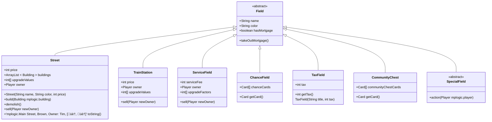
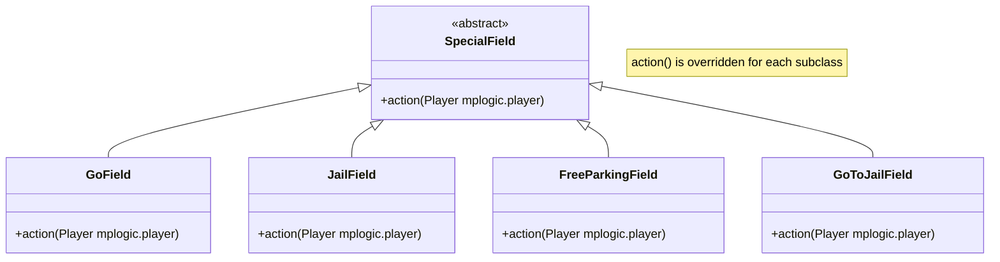
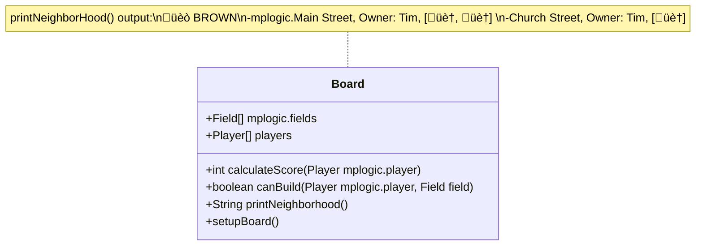
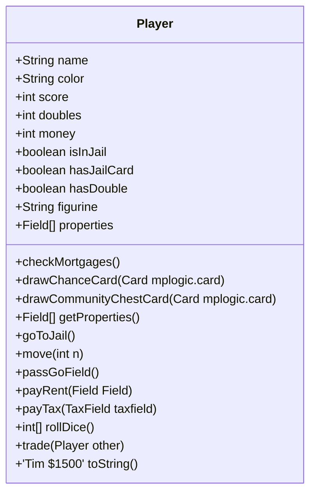
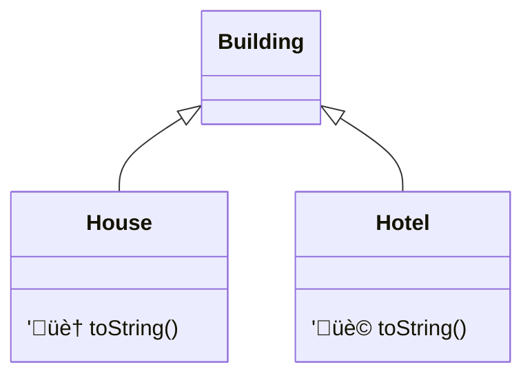
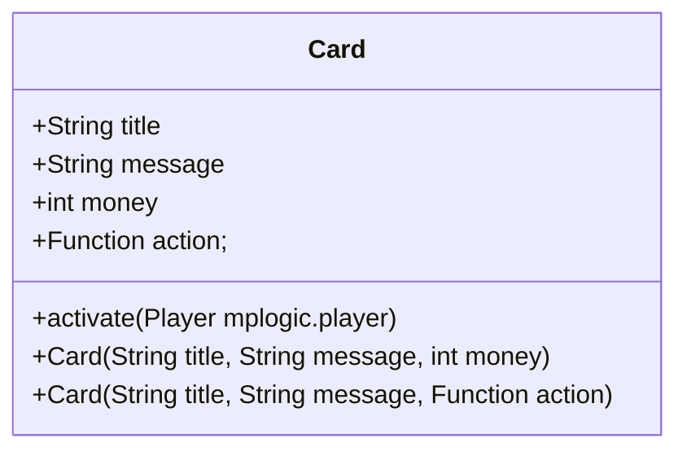

``` mermaid
classDiagram
Field <|-- Street
Field <|-- TrainStation
Field <|-- ServiceField
Field <|-- ChanceField
Field <|-- TaxField
Field <|-- CommunityChest
Field <|-- SpecialField

class Field{
+String name 
+String color
+boolean hasMortgage
+takeOutMortgage()
}
<<abstract>> Field

class Street{
+int price
+ArrayList < Building > buildings
+int[] upgradeValues
+Player owner
+Street(String name, String color, int price)
+build(Building mplogic.building)
+demolish()
+sell(Player newOwner)
+'mplogic.Main Street, Brown, Owner: Tim, [🏠, 🏠]' toString()
}
class TrainStation{
+int price
+Player owner
+int[] upgradeValues
+sell(Player newOwner)
}

class ServiceField{
+int serviceFee
+Player owner
+int[] upgradeFactors
+sell(Player newOwner)
}

class ChanceField{
+Card[] chanceCards
+Card getCard()
}

class TaxField{
+int tax
+int getTax()
TaxField(String title, int tax)
}

class CommunityChest{
+Card[] communityChestCards
+Card getCard()
}

class SpecialField{
+action(Player mplogic.player)
}
<<abstract>> SpecialField
```

``` mermaid
classDiagram
SpecialField <|-- GoField
SpecialField <|-- JailField
SpecialField <|-- FreeParkingField
SpecialField <|-- GoToJailField

<<abstract>> SpecialField

class SpecialField {
+action(Player mplogic.player)
}
class GoField {
+action(Player mplogic.player)
}
class JailField {
+action(Player mplogic.player)
}
class FreeParkingField {
+action(Player mplogic.player)
}
class GoToJailField {
+action(Player mplogic.player)
}

note "action() is overridden for each subclass"
```

``` mermaid
classDiagram

class Board{
+Field[] mplogic.fields
+Player[] players
+int calculateScore(Player mplogic.player)
+boolean canBuild(Player mplogic.player, Field field)
+String printNeighborhood()
+setupBoard()
}
note for Board "printNeighborHood() output:\n🏘 BROWN\n-mplogic.Main Street, Owner: Tim, [🏠, 🏠] \n-Church Street, Owner: Tim, [🏠] "
```

```mermaid
classDiagram
class Player{
+String name
+String color
+int score
+int doubles
+int money
+boolean isInJail
+boolean hasJailCard
+boolean hasDouble
+String figurine
+Field[] properties
+checkMortgages()
+drawChanceCard(Card mplogic.card)
+drawCommunityChestCard(Card mplogic.card)
+Field[] getProperties()
+goToJail()
+move(int n)
+passGoField()
+payRent(Field Field)
+payTax(TaxField taxfield)
+int[] rollDice()
+trade(Player other)
+'Tim $1500' toString()
}
```

``` mermaid
classDiagram
Building <|-- House
Building <|-- Hotel

class House{
'🏠 toString()
}
class Hotel{
'üè© toString() 
}
```

```mermaid
classDiagram
    class Card{
        +String title
        +String message
        +int money
        +Function<Void, Void> action;
        +activate(Player mplogic.player)
        +Card(String title, String message, int money)
        +Card(String title, String message, Function action)
    }
```